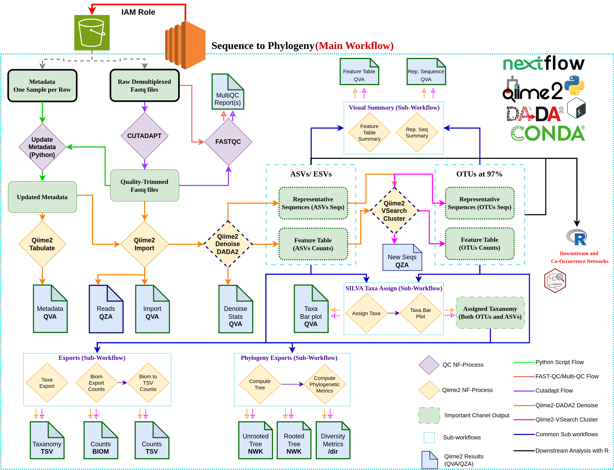

# Assessing the impact of gene sequence clustering strategies in determining microbe-microbe interactions in environmental microbiome datasets.

### Microbial Co-occurrence Networks
<p align="justify">
Microbes do not exist in isolation; instead, they thrive within communities, forming intricate associations. These associations govern their interactions, influencing both the structure of their microscopic environments and the larger ecosystems they inhabit.
</p>

<p align="justify">
To study patterns of association, microbiologists have employed principles of network science, which provide a framework to model these interactions. Microbial co-occurrence networks represent these pairwise associations graphically, offering insights into microbial ecology and community dynamics.
</p>


### OTUs vs ASVs
<p align="justify">
Since the advent of the DADA2 pipeline, which generates exact sequence variants (ESVs/ ASVs) rather than clustered operational taxonomic units (OTUs), a debate has persisted within the metagenomics community. Numerous studies have demonstrated that, under high sequence similarity thresholds, there is no statistically significant difference between these two approaches in terms of diversity metrics. However, the impact of these strategies on microbial co-occurrence networks remains unresolved.
</p>

### Objectives
<p align="justify">
This project aims to evaluate whether clustering microbiome gene sequences at varying levels of sequence similarity (97% to 100%) influences the inferred microbial interactions in correlation networks. Specifically, the study will assess the relative importance of habitat-driven microbial associations under these clustering strategies. We will use existing soil microbiome datasets from the Chernobyl Exclusion Zone (Ukraine). This study provides new insights into the methodological choices that influence microbial network inference and their ecological interpretations, offering a foundation for improved community assembly models.
</p>

### About the data

#### 16S Metagenomic Sequencing
<p align="justify">
16S rRNA gene sequencing, or simply 16S sequencing, utilizes PCR to target and amplify portions of the hypervariable regions (V1-V9) of the bacterial 16S rRNA gene. Amplicons from separate samples are then assigned molecular barcodes, pooled together, and sequenced. Following sequencing, the raw data undergoes processing via a bioinformatics pipeline that includes trimming, error correction, and comparison to a 16S reference database.
</p>

#### Experimental Design
<p align="justify">

</p>

### Workflow



#### Usage

**Configure the parameters and paths accordingly. The name of the file is `nextflow.config`.**

Execute the following to run the pipeline from start after.

```bash
nextflow run main.nf -with-conda --log
```

**Repository Structure**

```
Repo
│   
├── 01_Data_Preprocessing: Scripts for Generating Qiime2-Metadata.
│   
├── 03_ShellScripts: Entire Nextflow pipeline as a shell script.
│
│── bin
│   │── update_metadata.py: Python Script to update metadata columns.
│
│── envs: Conda environments
│   │── *.yml: Cutadapt, FastQC, MultiQC, Pandas.
│ 
│── modules: Nextflow modules and sub-workflows
│   │── cutadapt: Cutadapt Process.
│   │── fastqc: FastQC Process.
│   │── multiqc: MultiQC Process.
│   │── python: Update Metadata Process.
│   │── qiime2: Qiime2 Common Processes.
│   │   │── qiime2.nf: Includes Vsearch and DADA2 Processes.
│   │   │── qiime2_exports.nf: Exports Qiime2 artifacts to TSV & BIOM.
│   │   │── phylogeny.nf: Compute Trees and Metrics.
│   │   
│   │── sub_workflows (Applied to both ASVs and OTUs individually)
│   │   │── assign_silva_taxa_subflow.nf: Assigning taxanomy.
│   │   │── compute_phylogeny_subflow.nf: Downstream Phylogeny Analysis.
│   │   │── export_tables_subflow.nf: Export Data.
│   │   │── visual_summary_subflow.nf: Generate QVZ files.
│
│── rsc: Workflow
```


### Important References

---

Submitted (2021) to the School of Mathematics, Statistics and Applied Mathematics @University of Galway, Ireland for MSc in Computational Genomics.

---